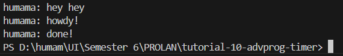

# tutorial-10-advprog-timer

## Reflection
### Experiment 1.2
Q: Why does "humama: hey hey" gets executed first?

A: 
In this case, the `TimerFuture` that gets completed after two seconds is awaited by appending `.await` to the `Future`. Before the `.await`, we have a `println!` macro that prints `"humama: howdy!"`. After the `.await`, we have another `println!` macro that prints `"humama: done!"`. Within the async block, the former `println!` macro gets executed first, since the executor executes the non-`Future`s immediately. Moving on, we encounter an awaited `Future` in the middle of the two `println!` macros. This tells the async block to execute the `Future` first, suspending the execution of any code after the `Future`, including non-`Futures`. After the awaiting the `Future`, the latter `println!` macro finally gets executed.

Moving out of the async block, we have a `println!` macro that prints `"humama: hey hey"`. Since async blocks return unawaited `Future`s, the async block placed as an argument of `spawn` gets executed late after the execution of the `println!` macro. This means everything within the async block runs after `"humama: hey hey"` gets printed to the console.

