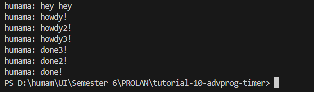

# tutorial-10-advprog-timer

## Reflection
### Experiment 1.2
Q: Why does "humama: hey hey" gets executed first?

A: 
In this case, the `TimerFuture` that gets completed after two seconds is awaited by appending `.await` to the `Future`. Before the `.await`, we have a `println!` macro that prints `"humama: howdy!"`. After the `.await`, we have another `println!` macro that prints `"humama: done!"`. Within the async block, the former `println!` macro gets executed first, since the executor executes the non-`Future`s immediately. Moving on, we encounter an awaited `Future` in the middle of the two `println!` macros. This tells the async block to execute the `Future` first, suspending the execution of any code after the `Future`, including non-`Futures`. After the awaiting the `Future`, the latter `println!` macro finally gets executed.

Moving out of the async block, we have a `println!` macro that prints `"humama: hey hey"`. Since async blocks return unawaited `Future`s, the async block placed as an argument of `spawn` gets executed late after the execution of the `println!` macro. This means everything within the async block runs after `"humama: hey hey"` gets printed to the console.

### Experiment 1.3
1. Q: What is the effect of spawning? 

   A: 
   Spawning here refers to spawning a new task for execution. Here, a task is a structure that represents something to be done. Therefore, spawning a new task for execution means instantiating a certain structure that represents something to be done in a program. 

   In the context of this program, spawning a new task puts a task in a channel represented by `task_sender` field of a `Spawner` instance, waiting to be executed by an executor.

2. Q: What is the spawner for, what is the executor for, what is the drop for? 

   A: 
   As the name suggests, the spawner spawns new tasks to be executed, the executor runs the spawned tasks, and the drop simply calls the underlying `drop` method of the spawner. 
   
   The spawner is responsible for creating new tasks. In asynchronous programming, a task is a unit of work, similar to a thread in synchronous programming. However, tasks are lighter than threads and can be spawned in much larger numbers. The spawner puts these tasks into a queue, ready to be picked up by the executor. In this program, the queue's sending-half is represented by the `task_sender` field of `Spawner`. 
   
   The executor is responsible for managing the execution of the tasks sent to `task_sender`. If the `task_sender` field of `Spawner` is the sending-half of the queue, then the `ready_queue` field of `Executor` is the receiving-half of the queue. Since `ready_queue` and `task_sender` are interconnected, tasks sent to `task_sender` will appear at `ready_queue`. The executor picks up tasks from the `ready_queue` field and runs them.

   In Rust, the `Drop` trait is used to run some code when a value goes out of scope. This is often used for cleanup. In the context of a spawner, the drop method is used to signal to the executor that no more tasks will be spawned, so it can shut down when all tasks are done.

Commenting the `drop` function prevents the program from signaling the executor to shut down after all tasks has been done. Thus, the executor waits for more tasks to spawn forever.

